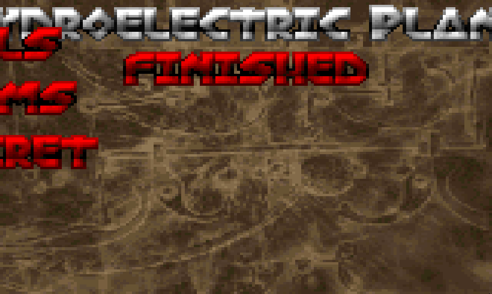
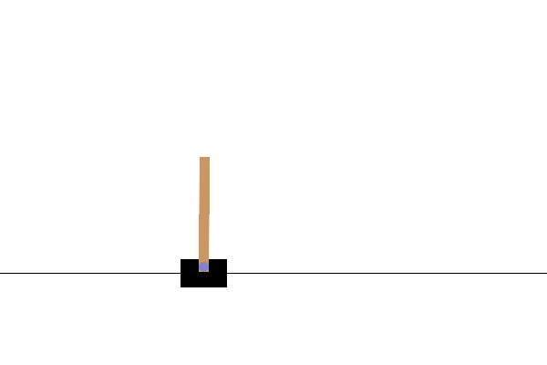
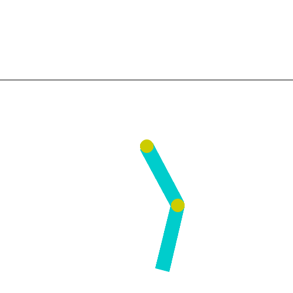
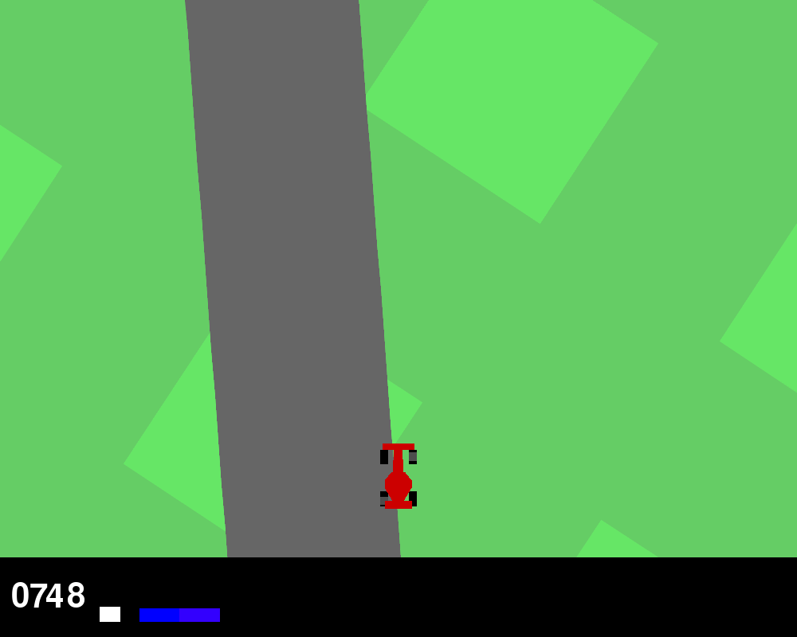
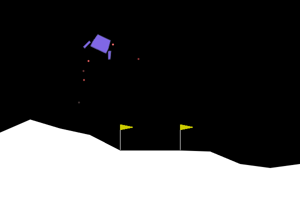
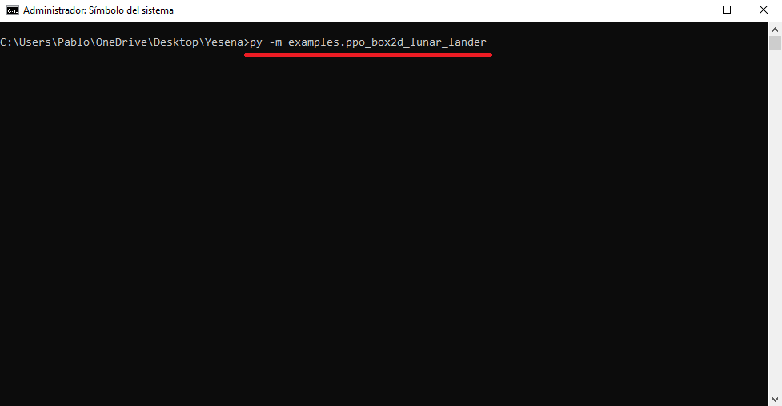
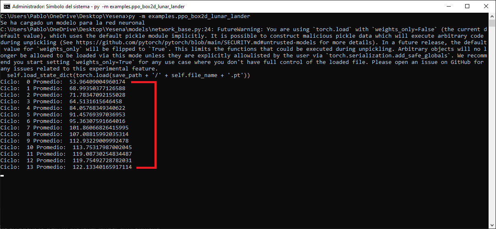

<p></p>

<p>Yesena is a framework for beginners that will allow you to learn the main methods of Reinforcement Learning.</p>

<hr/>

<p>Vizdoom</p>

<p>
  
  
</p>

<p>Clasic Control</p>

<p>
  
  
</p>

<p>Box 2D</p>

<p>
  
  
</p>

<p></p>

- [Description](#description)
- [Installation](#installation)
- [Example](#example)
- [License](#license)

<p></p>

<p>This project has documented all its files with clear and precise descriptions of its components, so that you can learn the meaning of each of the parts necessary to solve a reinforcement learning problem.</p>

<p>It also has many tests so that you become familiar with how it works.</p>

<p></p>

```bash
git clone https://github.com/AifaRobot/Yesena.git
cd Yesena
pip install -r requirements.txt
```

<p></p>

<p>In the examples folder you can find already facts like the one you see here:</p>

```python
from methods.ppo import PPO
from models import ActorCriticFactory3
from workers import WorkerFactoryGymLunarLander
from tests import GymTestLunarLander

if __name__ == "__main__":
    
    arguments = {
        "env_name": "LunarLander-v3",
        "lr": 0.0001,
        "gamma": 0.99,
        "value_coeficient": 0.5,
        "entropy_coeficient": 0.01,
        "clip": 0.1,
        "minibatch_size": 32,
        "batch_size": 128,
        "epochs": 4,
        "episodes": 2000,
        "lam": 1.0,
        "in_channels": 8,
        "n_actions": 4,
        "num_processes": 5,
    }

    method = PPO(
        main_model_factory = ActorCriticFactory3,
        worker_factory = WorkerFactoryGymLunarLander,
        test_factory = GymTestLunarLander,
        arguments = arguments,
    )

    method.train()
    method.test()
```

<p>To run this example, you need to go to the root folder of the project with the command prompt and run the following command:</p>

<p></p>

<p>This command will create an agent to train in the lunar lander environment:</p>

<p></p>

<p>When the agent has completed the training, the following will be executed:</p>

<p></p>

<p></p>

<p>This project is licensed under the Apache 2.0 License. See the <a href="/LICENSE.txt">LICENSE</a> file for details.</p>
